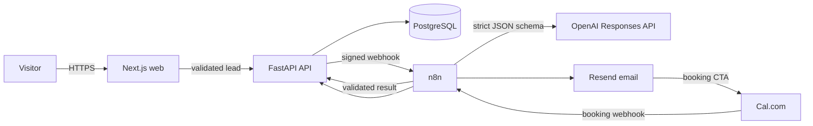

# SalesFlow AI

SalesFlow AI is a portfolio-quality AI sales automation platform that captures detailed inbound leads, qualifies them with a validated AI score, routes follow-up through n8n and Resend, connects qualified buyers to Cal.com, and keeps every action visible inside a focused CRM.

> Seed records are clearly marked **Demo**. Dashboard metrics are always computed from PostgreSQL; no chart contains hard-coded production-looking numbers.

## Product capabilities

- Premium responsive marketing site and a real multi-field lead funnel
- Secure administrator authentication with Argon2 hashing and signed JWT access tokens
- Searchable/filterable CRM, lead profiles, notes, email history, appointments and full activity timelines
- Persisted seven-stage opportunity Kanban
- OpenAI Structured Outputs qualification with strict JSON Schema plus Pydantic validation
- n8n qualification, hot follow-up, warm nurture and appointment-event workflows
- Responsive Resend email templates with Cal.com booking calls to action
- Live dashboard polling, operational automation history and database-backed analytics
- Rate limiting, CORS, internal service secrets, webhook idempotency, timeouts and retries
- Explicit Alembic migrations, Dockerfiles and production Compose topology

## Architecture



The API is the source of truth. n8n only orchestrates API-driven workflows and never writes directly to product tables. n8n uses a separate PostgreSQL schema and persistent volume.

## Repository

```text
apps/web          Next.js, TypeScript, Tailwind, TanStack Query, Recharts
apps/api          FastAPI, SQLAlchemy, Pydantic, Alembic, pytest
infrastructure    Import-ready n8n workflows and deployment assets
docs              Portfolio case study and operational guidance
docker-compose.yml
```

## Local setup

1. Copy `.env.example` to `.env` and populate every blank secret.
2. Generate unique values with `openssl rand -hex 32` for `JWT_SECRET`, `N8N_WEBHOOK_SECRET`, `CALCOM_WEBHOOK_SECRET` and `N8N_ENCRYPTION_KEY`.
3. Set `ADMIN_EMAIL` and a strong `ADMIN_PASSWORD`. The password is read only by the bootstrap job and is never committed.
4. Run `docker compose up --build`.
5. Open the web app at `http://localhost:3000`, the API health check at `http://localhost:8000/health`, and n8n at `http://localhost:5678`.
6. Import the four files under `infrastructure/n8n/workflows`, configure their environment variables, and activate the downstream workflows before Lead Qualification.

For development without Docker:

```bash
npm install
npm run dev:web
python -m venv .venv
.venv/bin/pip install -r apps/api/requirements.txt
cd apps/api && ../../.venv/bin/alembic upgrade head
PYTHONPATH=apps/api .venv/bin/uvicorn app.main:app --reload
```

## Environment variables

`.env.example` is the canonical inventory. Important groups are:

- Application: `APP_URL`, `API_URL`, `NEXT_PUBLIC_API_URL`, `CORS_ORIGINS`
- Database: `DATABASE_URL`, `POSTGRES_DB`, `POSTGRES_USER`, `POSTGRES_PASSWORD`
- Auth: `JWT_SECRET`, `ADMIN_EMAIL`, `ADMIN_PASSWORD`, `ACCESS_TOKEN_MINUTES`
- OpenAI: `OPENAI_API_KEY`, `OPENAI_MODEL`
- Automation: `N8N_LEAD_WEBHOOK_URL`, `N8N_WEBHOOK_SECRET`, `N8N_ENCRYPTION_KEY`, `WEBHOOK_URL`
- Email: `RESEND_API_KEY`, `RESEND_FROM_EMAIL`
- Scheduling: `CALCOM_BOOKING_URL`, `CALCOM_WEBHOOK_SECRET`

Never prefix server secrets with `NEXT_PUBLIC_`. Never commit `.env`.

## API structure

- `POST /api/public/leads` — rate-limited public capture; persists before starting automation
- `POST /api/auth/login` — administrator token creation
- `GET /api/leads`, `GET /api/leads/{id}` — protected CRM views
- `PATCH /api/leads/{id}/stage`, `POST /api/leads/{id}/notes` — protected CRM actions
- `POST /api/internal/leads/{id}/qualification` — signed n8n callback with strict validation
- `POST /api/internal/leads/{id}/emails` — signed provider activity logging
- `POST /api/internal/automation-runs` — idempotent workflow telemetry
- `POST /api/webhooks/calcom` — idempotent booking association by attendee email
- `GET /api/dashboard`, `GET /api/automations` — database-backed reporting

FastAPI publishes interactive OpenAPI documentation at `/docs`.

## Demo workflow

1. Open `/demo` and submit a business-safe or fictional lead.
2. The API commits the lead and its first timeline event before calling n8n.
3. n8n validates the webhook and calls OpenAI using a strict output schema.
4. The API validates the response again, persists the score and advances eligible opportunities.
5. n8n chooses the hot or warm follow-up and sends a Resend email.
6. The recipient books through Cal.com; the appointment workflow associates the attendee email with the lead and moves it to **Meeting Scheduled**.
7. The dashboard polls for the result, and the lead timeline shows every state transition.

## Tests

```bash
PYTHONPATH=apps/api .venv/bin/pytest -q apps/api/tests
npm run build:web
```

The backend suite covers lead creation/validation, qualification persistence, webhook authentication, persisted pipeline activity, appointment association and duplicate booking delivery.

## Production deployment

The intended Dokploy project contains four isolated services: `web`, `api`, `postgres` and `n8n`. PostgreSQL and n8n data use named persistent volumes; API startup runs explicit Alembic migrations before bootstrapping the admin and optional sample records. Only web, API and the protected n8n editor/webhook surface need public routes. Health checks gate API and database startup.

Suggested routes: `salesflow.icha.ng`, `api.salesflow.icha.ng`, and `automation.salesflow.icha.ng`. DNS should only be changed after confirming that these names are unused.

## Security notes

- Passwords use Argon2; secrets remain server-side.
- Public inputs are length-bounded, normalized and validated before persistence.
- Qualification is schema-constrained at OpenAI and validated again by Pydantic.
- n8n callbacks use constant-time shared-secret comparison; booking events and workflow runs use unique idempotency keys.
- Third-party calls have bounded timeouts and retries. Failure happens after the lead commit, so acquisition data is never lost.
- Production should rotate all bootstrap and integration secrets after handoff, restrict the n8n editor, and add a managed backup policy.

## Screenshots

Add production captures here after deployment:

- Public homepage and live lead funnel
- Revenue overview and analytics
- AI-qualified lead profile with activity timeline
- Sales pipeline and automation execution view

See [the case study](docs/CASE_STUDY.md) for the engineering narrative.

